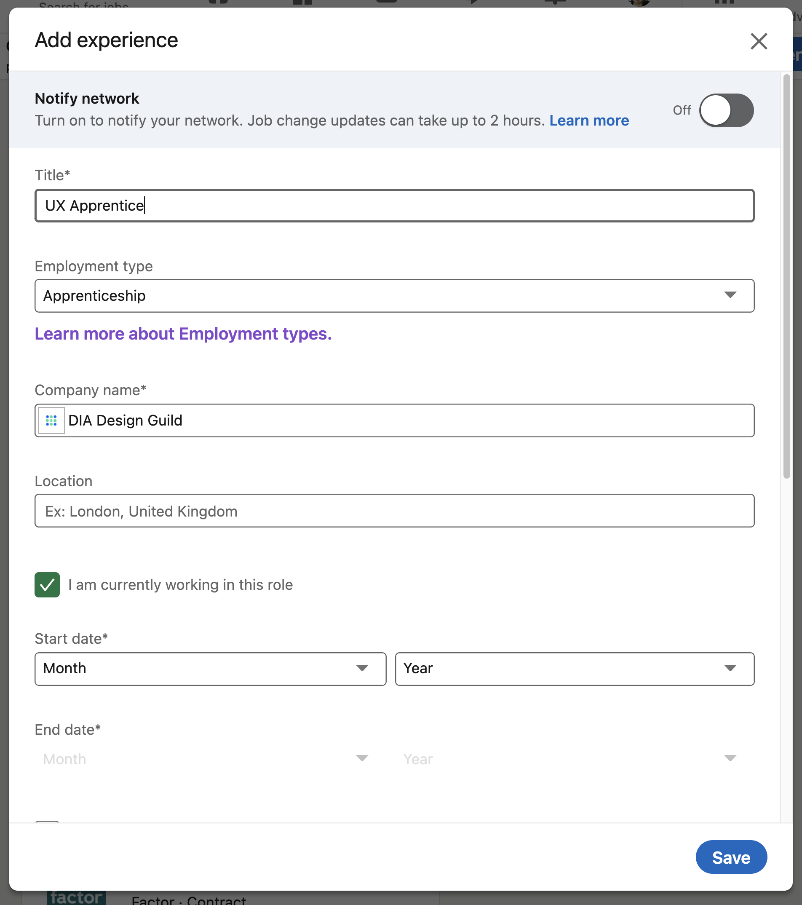

# Update your LinkedIn


Take care to indicate "**Apprenticeship**" as the employment type on LinkedIn.&#x20;



We've listed a couple of descriptions that you can use to describe DIA Design Guild when you update your experience listing on LinkedIn.&#x20;

<details>

<summary>Version 1</summary>

A year-long apprentice program providing early career and transitioning professionals with a safe, supportive learning network to practice what they learn and build their understanding in user experience, design, research, and content strategy from a holistic approach, DIA Design Guild pairs apprentices with senior coaches and encourages problem-solving through real-world projects with nonprofits and community organizations.

</details>

<details>

<summary>Version 2</summary>

DIA Design Guild prides itself in providing a safe environment for early career and transitioning professionals to flex their skills and develop their portfolios by pairing them with senior coaches.

</details>

## Evaluate

* [ ] Does it communicate what the company is?
* [ ] Does it infer what kind of skills you might obtain from this experience?
* [ ] Have you added what you do and how you added value to the Guild?

```
**How would you describe the Apprentice Program?**&#x20;

Share and we'll add it to the list.&#x20;
```